# Real-Time Banking Data Pipeline

A real-time banking analytics pipeline built with PostgreSQL, Debezium, Kafka, MinIO, Airflow, Snowflake, dbt, and Power BI.

The system captures change data from PostgreSQL, streams it through Kafka, lands raw CDC data in MinIO as Parquet, loads it into Snowflake, transforms it with dbt, orchestrates the workflow with Airflow, and exposes curated views for reporting in Power BI.

## Overview

This repository includes:

- PostgreSQL as the transactional source system
- Debezium for change data capture from PostgreSQL WAL
- Kafka for event streaming
- MinIO as S3-compatible object storage for raw Parquet files
- Snowflake as the analytics warehouse
- dbt for staging, snapshots, marts, and BI-facing models
- Airflow for orchestration
- Power BI for reporting on curated Snowflake views
- GitHub Actions for CI checks

## Architecture

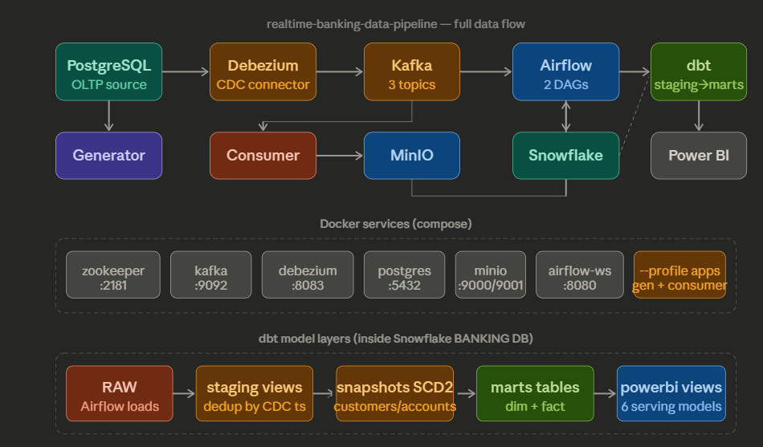

## End-to-end flow

1. A Python generator writes synthetic banking activity into PostgreSQL.
2. Debezium reads PostgreSQL WAL changes and publishes CDC events to Kafka topics.
3. A Python consumer reads Kafka topics, enriches records with CDC metadata, and writes Parquet batches to MinIO.
4. An Airflow DAG detects new files in MinIO and loads them into Snowflake `RAW` tables.
5. A second Airflow DAG runs dbt staging models, snapshots, marts, and tests.
6. Power BI connects to curated Snowflake serving views.

## Technology stack

| Layer | Tool | Purpose |
|---|---|---|
| Source OLTP | PostgreSQL | Transaction-style relational source |
| CDC | Debezium | Captures inserts, updates, and deletes from PostgreSQL |
| Streaming | Kafka | Event transport between source capture and downstream consumers |
| Landing zone | MinIO | Local S3-compatible object storage for raw Parquet |
| Warehouse | Snowflake | Central analytics warehouse |
| Transformations | dbt | SQL-based modeling, testing, and snapshots |
| Orchestration | Airflow | Scheduling and task orchestration |
| BI | Power BI | Reporting over curated warehouse views |
| Local platform | Docker Compose | Local multi-service environment |

## Repository structure

```text
.
├── .github/workflows/              # CI/CD workflows
├── banking_dbt/                    # dbt project: sources, staging, snapshots, marts, BI views
├── common/                         # shared config helpers
├── consumer/                       # Kafka -> MinIO CDC consumer
├── data-generator/                 # synthetic banking data generator
├── docker/dags/                    # Airflow DAGs
├── docs/                           # guides and screenshots
├── kafka-debezium/                 # Debezium connector registration
├── postgres/                       # source schema/bootstrap SQL
├── powerbi/                        # BI notes, DAX guidance, model design files
├── scripts/                        # helper scripts
├── snowflake/                      # Snowflake setup SQL
├── tests/                          # unit tests
├── .env.example                    # local environment template
├── docker-compose.yml              # local stack definition
├── dockerfile-airflow.dockerfile   # Airflow image with dbt
├── dockerfile-app.dockerfile       # generator / consumer image
├── requirements.txt                # Python dependencies
└── requirements-runtime.txt        # runtime dependency split
```

## Data model layers

### RAW
Snowflake `RAW` stores landed CDC records from MinIO before transformation.

### Staging
The staging models standardize types, preserve metadata, and prepare records for downstream modeling.

- `stg_customers`
- `stg_accounts`
- `stg_transactions`

### Snapshots
Snapshots preserve historical versions for slowly changing dimensions.

- `customers_snapshot`
- `accounts_snapshot`

### Marts
The marts expose analytics-friendly dimensions and facts.

- `dim_customers`
- `dim_accounts`
- `fact_transactions`

### Power BI serving layer
These models are intended to be the reporting contract.

- `pbi_dim_customers_current`
- `pbi_dim_accounts_current`
- `pbi_fact_transactions`
- `pbi_dim_date`
- `pbi_cdc_audit`
- `pbi_pipeline_health`

## Prerequisites

Before running locally, make sure you have:

- Docker Desktop running
- Python 3.11 installed
- PowerShell available
- a Snowflake account with permission to create and use project objects
- Power BI Desktop if you want to build or inspect the report layer

## Local configuration

### 1) Create your local environment file

```powershell
Copy-Item .env.example .env
```

### 2) Create your dbt profile

```powershell
New-Item -ItemType Directory -Force banking_dbt\.dbt | Out-Null
Copy-Item banking_dbt\.dbt\profiles.yml.example banking_dbt\.dbt\profiles.yml
```

### 3) Update local values before running

At minimum, review:

- PostgreSQL values
- MinIO credentials and bucket name
- Airflow admin credentials
- Snowflake account, user, password, warehouse, database, schema, and role

## Local run guide (Windows PowerShell)

### 1) Open the repository

```powershell
cd "C:\Users\acer\github-clean-replace\repo-clone"
```

### 2) Create a virtual environment for local Python commands

```powershell
python -m venv .venv
.\.venv\Scripts\Activate.ps1
python -m pip install --upgrade pip
pip install -r requirements.txt
```

### 3) Start the core platform

```powershell
docker compose up -d --build
docker compose ps
```

Expected core services:

- postgres
- zookeeper
- kafka
- connect
- minio
- airflow-webserver
- airflow-scheduler
- airflow-postgres

### 4) Register the Debezium connector

```powershell
python .\kafka-debezium\register_connector.py
```

### 5) Start the generator and consumer

```powershell
docker compose --profile apps up -d generator consumer
docker compose ps
```

### 6) Open the local UIs

- Airflow: `http://localhost:8080`
- Debezium Connect: `http://localhost:8083/connectors`
- MinIO Console: `http://localhost:9001`

### 7) Run dbt manually if needed

```powershell
cd banking_dbt
dbt deps
dbt run --select staging
dbt snapshot
dbt run --select marts
dbt test
cd ..
```

## Validation checklist

Use this checklist after startup:

- `docker compose ps` shows all core services as running
- Debezium connector shows as created and running
- generator and consumer containers are running
- MinIO `raw` bucket receives Parquet files partitioned by source table
- Airflow shows the ingestion DAG and dbt DAG
- Snowflake `RAW` tables contain landed records
- dbt models build successfully
- Power BI connects to curated serving views, not raw tables

## Proof of execution

### Local Docker services
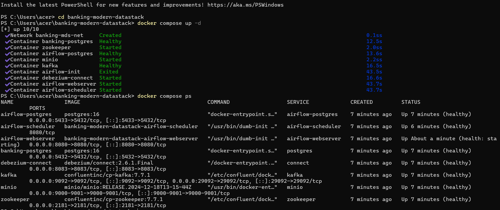

### Debezium connector running
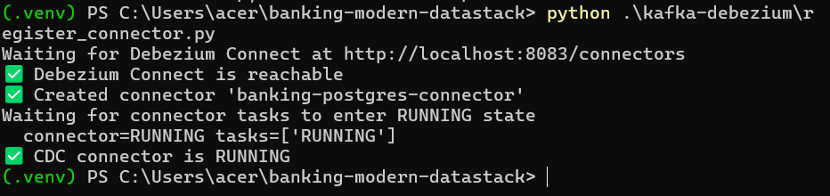

### Generator and consumer started
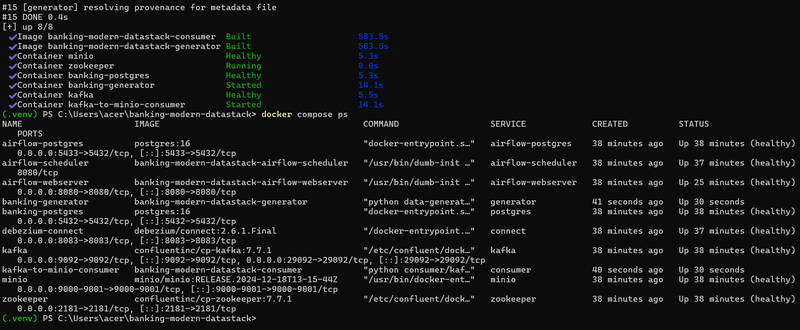

### Generator writing iterative banking activity
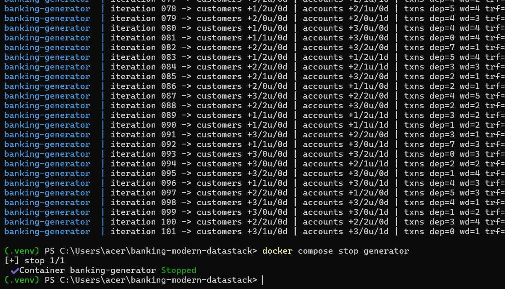

### Consumer writing batches to MinIO
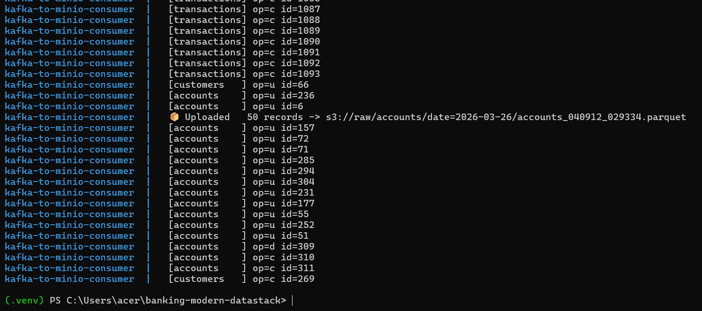

### MinIO raw bucket
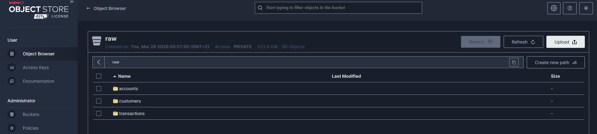

### Airflow DAG list
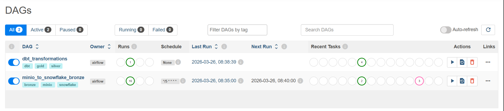

### Airflow MinIO -> Snowflake DAG
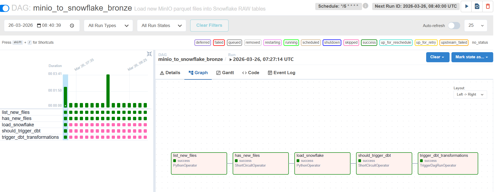

### Airflow dbt DAG
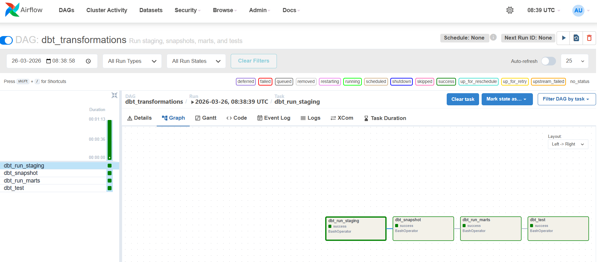

### Snowflake database objects populated
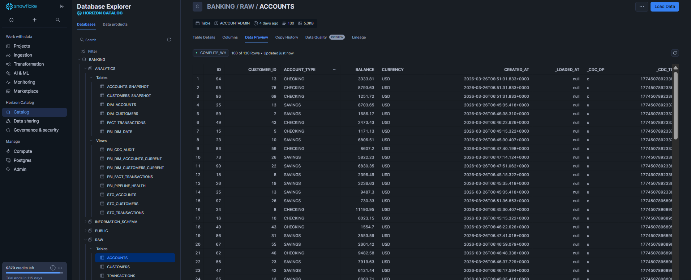

### Power BI semantic model
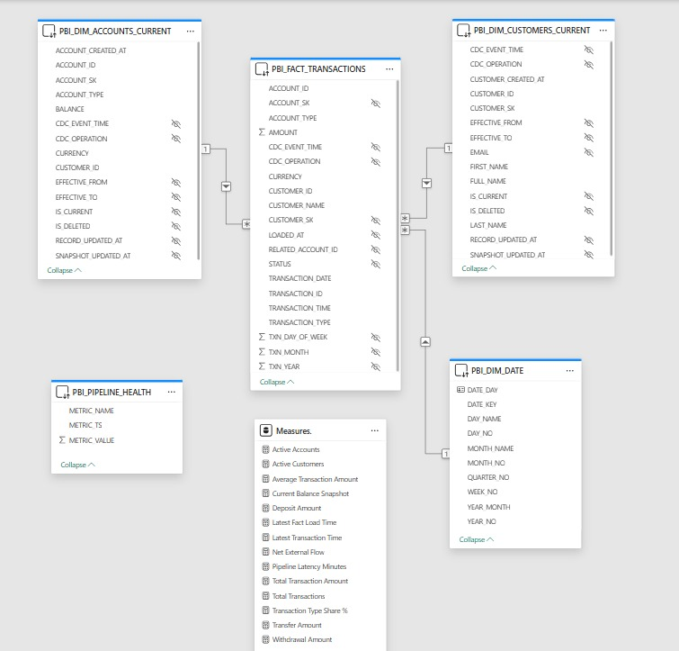

## CI/CD

### CI
The CI workflow validates:

- Ruff linting
- pytest unit tests
- dbt dependency install and parse validation

### CD
The CD workflow runs dbt against Snowflake on push to `main` when the required repository secrets are configured.

Required GitHub Actions secrets include:

- `SNOWFLAKE_ACCOUNT`
- `SNOWFLAKE_USER`
- `SNOWFLAKE_PASSWORD`
- `SNOWFLAKE_WAREHOUSE`
- `SNOWFLAKE_ROLE`

## Troubleshooting

### Docker services do not come up cleanly

Check:

```powershell
docker compose ps
docker compose logs -f kafka
docker compose logs -f connect
docker compose logs -f airflow-webserver
docker compose logs -f airflow-scheduler
```

Verify:

- Docker Desktop is fully running
- required ports are free
- `.env` exists and is filled correctly

### Debezium connector does not register

Check:

```powershell
docker compose logs -f connect
python .\kafka-debezium\register_connector.py
```

Verify:

- PostgreSQL is healthy
- Debezium Connect is reachable on `localhost:8083`
- connector credentials in `.env` are correct

### Generator runs but MinIO stays empty

Check:

```powershell
docker compose logs -f generator
docker compose logs -f consumer
```

Verify:

- generator and consumer containers are both running
- Kafka bootstrap address is correct
- MinIO credentials and bucket name match `.env`

### Airflow DAG exists but Snowflake tables do not load

Check:

```powershell
docker compose logs -f airflow-scheduler
docker compose logs -f airflow-webserver
```

Then inspect task logs in the Airflow UI.

Verify:

- Snowflake credentials are correct
- target database and schema exist
- MinIO contains files under the expected prefixes

### dbt fails

Run manually:

```powershell
cd banking_dbt
dbt deps
dbt debug
dbt run --select staging
dbt snapshot
dbt run --select marts
dbt test
cd ..
```

Verify:

- Snowflake account and role are correct
- local dbt profile is complete
- warehouse and schema match the intended target

### Need a clean local reset

Stop services:

```powershell
docker compose down
```

Remove volumes too:

```powershell
docker compose down -v
```

Then rebuild:

```powershell
docker compose up -d --build
```

## Power BI note

The report should connect to curated Snowflake serving views, not directly to raw or intermediate tables.

Recommended Power BI-facing objects:

- `PBI_FACT_TRANSACTIONS`
- `PBI_DIM_DATE`
- `PBI_DIM_ACCOUNTS_CURRENT`
- `PBI_DIM_CUSTOMERS_CURRENT`
- `PBI_PIPELINE_HEALTH`

## Security note

This repository includes templates only.

Do **not** commit:

- `.env`
- real Snowflake passwords
- real dbt profiles with secrets
- exported Power BI credentials
- any private account identifiers you do not want public
